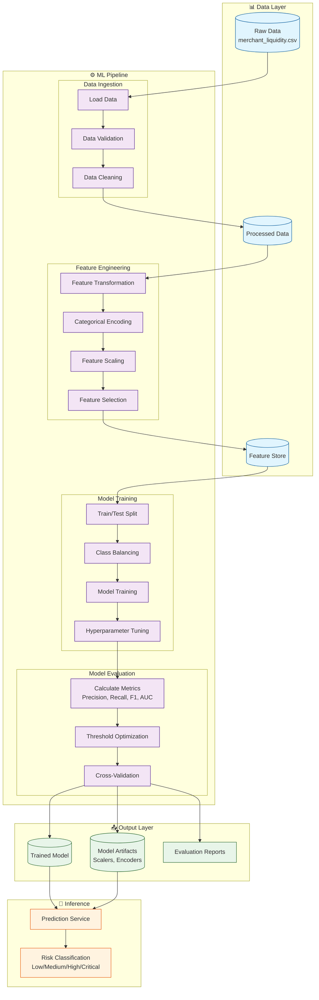

# PocketQuant - ML Pipeline Architecture

## System Architecture Diagram



## Component Details

### 1. Data Layer
| Component | Description | Location |
|-----------|-------------|----------|
| Raw Data | Original merchant liquidity dataset | `data/merchant_liquidity.csv` |
| Processed Data | Cleaned and validated data | `data/processed/` |
| Feature Store | Engineered features ready for modeling | `data/features/` |

### 2. ML Pipeline Components

#### Data Ingestion
- **Load Data**: Read CSV with proper dtypes
- **Data Validation**: Schema validation, null checks
- **Data Cleaning**: Handle missing values, outliers

#### Feature Engineering
- **Feature Transformation**: Log transforms, ratios
- **Categorical Encoding**: Label/One-hot encoding
- **Feature Scaling**: StandardScaler/MinMaxScaler
- **Feature Selection**: Correlation, importance-based

#### Model Training
- **Train/Test Split**: Temporal split with 80/20 ratio
- **Class Balancing**: SMOTE, class weights
- **Model Training**: Multiple algorithm comparison
- **Hyperparameter Tuning**: GridSearchCV, Optuna

#### Model Evaluation
- **Metrics**: Precision, Recall, F1, ROC-AUC
- **Threshold Optimization**: PR curve analysis
- **Cross-Validation**: Stratified K-Fold

### 3. Output Layer
| Component | Format | Location |
|-----------|--------|----------|
| Trained Model | `.joblib` | `models/trained/` |
| Artifacts | `.pkl` | `models/artifacts/` |
| Reports | `.html`, `.json` | `reports/` |

### 4. Inference Layer
- **Prediction Service**: Batch/single prediction capability
- **Risk Classification**: Probability to risk level mapping

## Data Flow Summary

```
Raw Data → Ingestion → Processing → Feature Engineering → Training → Evaluation → Model Export
                                                                              ↓
                                                                    Inference Pipeline
```

## Technology Stack

| Layer | Technologies |
|-------|-------------|
| Data Processing | Pandas, NumPy |
| Feature Engineering | Scikit-learn, Feature-engine |
| Modeling | Scikit-learn, XGBoost, LightGBM |
| Evaluation | Scikit-learn metrics, Matplotlib |
| Experiment Tracking | MLflow (optional) |
| Serialization | Joblib, Pickle |

---

*Architecture document for PocketQuant Liquidity Prediction System*
